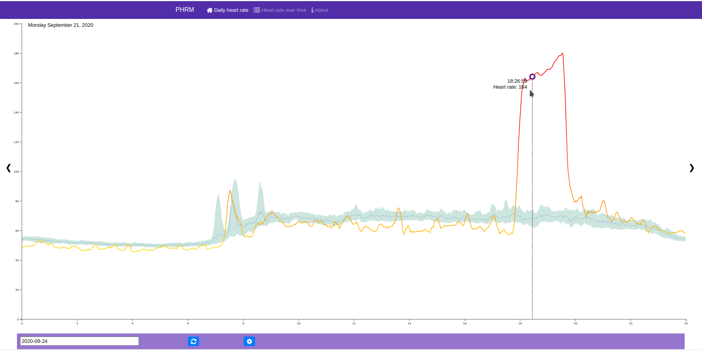

# Personal Heart Rate Monitor (PHRM)

Since the beginning of 2020, I got myself a Fitbit Charge 3 that monitors my heart-rate 24/7. Since it was possible to access this data, I decided to write an application to visualize the data.

The main idea for the application is to be able to see how the heart rate for a given day compares to the median + given percentiles over a certain range.

Besides this visualization, I also want to add comparison of medians of different ranges (allows you to compare different ranges of time)

Most important is that this application is a very good playground for me to work on both the backend application in Python (using Flask) and a frontend HTML/CSS/JS website using D3. Instead of using the flask static or template folder, I opted for using a separate application that is bundled using webpack

# TODO Items
With some manual setup, the application is already working (and I am quite happy with it :)). However, there are still a couple of things that I need to work on:

* Instruction for how to create the required OAuth credentials for your own data
* Update the application to be able to work with custom OAuth credentials
* Implement the comparison of median heart-rates over time (e.g. compare january weekdays with february weekdays)
* Implement error handling for issues with Fitbit API. This mostly will be the handling of ratelimit errors and giving the user a nice error (you cannot exceed 200 requests per hour)
* Re-implement different bucket size and moving average intervals (will require me to store the raw fitbit data first instead, so storage usage will go up)
* Store user information in the database also
